# ラズパイでコンテナに触れてみよう

## 目次

[TOC]


## はじめに

（仮文言）

本研修では、シングルボードコンピュータであるRaspberry Piを用いたKubernetsクラスタの構築を通じて、Kubernetesの仕組みや構築・運用方法をざっくりと理解することを目的としています。

本研修を完了すると以下のようなクラスタが完成します。手順が多く大変ですが、楽しみながら学習していただけると幸いです。

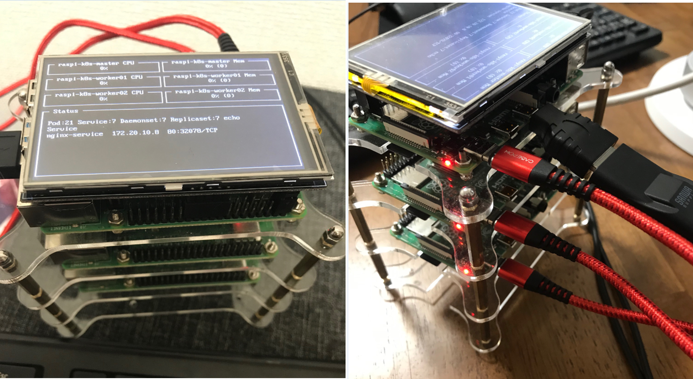


### 本研修のスケジュール

本研修は以下のスケジュールで進めていただきます。

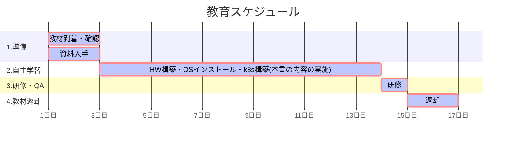
```mermaid
gantt
dateFormat YYYY/MM/DD
axisFormat %e日目
title 教育スケジュール
todayMarker off

section 1.準備
教材到着・確認: crit, active, t1, 2021/01/01, 2d
資料入手:      crit, active, t2, 2021/01/01, 2d

section 2.自主学習
HW構築・OSインストール・k8s構築(本書の内容の実施): crit, active, t3, 2021/01/03, 11d

section 3.研修・QA
研修:crit,active,t4,2021/01/14,1d

section 4.教材返却
返却:crit,active,t5,2021/01/15,2d
```

通常の研修とは異なり、大部分が自主学習となっています。
ビデオ通話を用いたハンズオン研修も予定しておりますが、こちらは本書の内容を完了できていない受講者のフォローやトラブルシュートが主な内容となります。

使用した機材は、ハンズオン研修終了後 翌2日以内に同梱されている着払い伝票（ゆうパック）にて返却してください。


## 1. 事前準備

Kubernetesを構築する前に、必要機材の確認やハードウェアなどの準備を行います。

### 1.1 必要機材の確認

受け取った教材に、以下の機材が同梱されていることを確認してください。
教材に不備・不足などあった場合は速やかに事務局(managed-paas@sdb.jp.nec.com)までご連絡ください。

| 機材名                                | 個数 | 説明                                                         |
| ------------------------------------- | ---- | ------------------------------------------------------------ |
| Raspberry Pi 4 Model B (4GB RAM)      | 3    | サーバとして使用                                             |
| microSDカード                         | 4    | Raspberry Piのストレージとして使用。<br />OSインストール済み。1枚は予備。 |
| ACアダプタ                            | 3    | Raspberry Piの電源供給に使用                                 |
| 充電用USB Type-Cケーブル （3個入）    | 1    | Raspberry Piの電源供給に使用                                 |
| 電源タップ                            | 1    | Raspberry Piの電源供給に使用                                 |
| Stackable Acrylic Case                | 1    | Raspberry Pi用の積層ケース                                   |
| HDMI - microHDMI変換アダプタ          | 1    | Raspberry Piの映像出力をHDMIに変換するために使用             |
| OSOYOO 3.5" Raspberry Pi Touch Screen | 1    | Raspberry Pi用の小型ディスプレイ                             |


また、以下の機材については受講者各自でご用意ください。

| 機材名                     | 個数 | 説明                                                     |
| -------------------------- | ---- | -------------------------------------------------------- |
| HDMI接続可能なディスプレイ | 1    | Raspberry Piに接続するためのディスプレイ                 |
| HDMIケーブル               | 1    | Raspberry Piとディスプレイを接続するためのケーブル       |
| USBキーボード              | 1    | Raspberry Piに接続して使用するためのキーボード           |
| 社有iPhone                 | 1    | Raspberry Pi同士の接続およびインターネットアクセスに使用 |
| シンクラ端末(SS10など)     | 1    | 本資料の参照やトラブルシュート時の調査・情報収集に使用   |

### 1.2 Raspberry Piのラック組み立て

Raspberry Piと積層ケースを開封しラックを組み立てます。

多少機材が異なりますが、以下サイトを参考に組み立ててください。
https://developers.cyberagent.co.jp/blog/archives/14721/

下から1段目は空にして、2~4段目にRaspberry Piを配置すると取り回しやすくなります。
**この時点では小型ディスプレイは接続しないでください。**

以下はmicroSDをセットする前のRaspberry Piのイメージ図です。

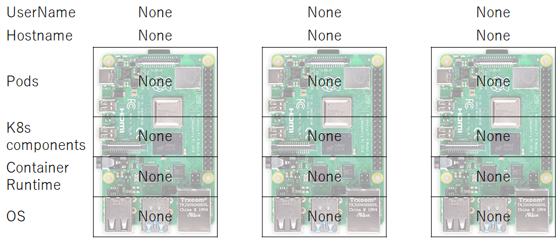

Raspberry PiはmicroSDにOSがインストールされているため、microSDをセットする前の状態では電源を接続しても起動しません。


### 1.2 OSのインストール

---

**教材に同梱されているmicroSDには既にOSをインストールしているため、本章は飛ばして「[1.3 iPhoneの設定変更](#1.3_iPhoneの設定変更)」に進んでください。**

OSインストール済みの予備のmicroSDも同梱しておりますが、OSが起動しなくなったなどの問題があった場合は本章を参照して対応して下さい。

---

Raspberry Pi OS イメージを SD カードへインストールします。  本章では、書込みPC およびSDカード3枚を利用します。  

以下はRaspberry Pi OSをインストールした後のイメージ図です。

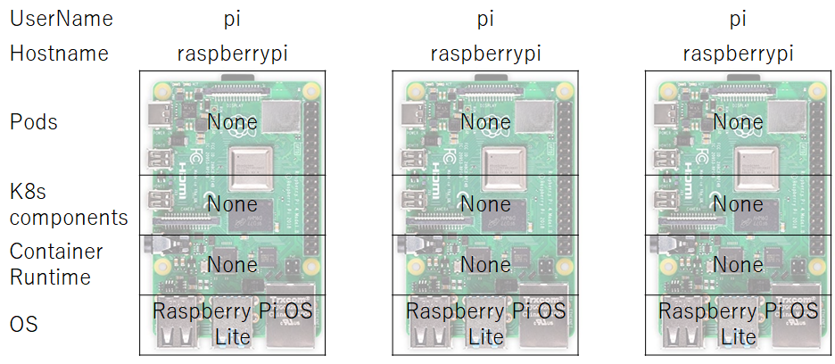

この手順を完了することで、Raspberry Piをコンピュータとして起動できるようになります。

#### 前提条件

- 書込PCはWindows10であること

#### 手順

1. **Raspberry Pi Imager for Windows** を以下のURLからダウンロード
    https://downloads.raspberrypi.org/imager/imager_latest.exe

2. ダウンロードしたEXEを実行し、Raspberry Pi Imager for Windowsをインストール

3. PCにSDカードを挿入

4. Raspberry Pi Imagerを起動

   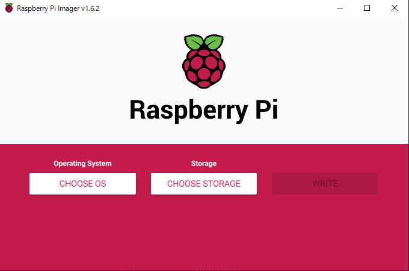

5. [CHOOSE OS]をクリックし、OS選択画面を開く

   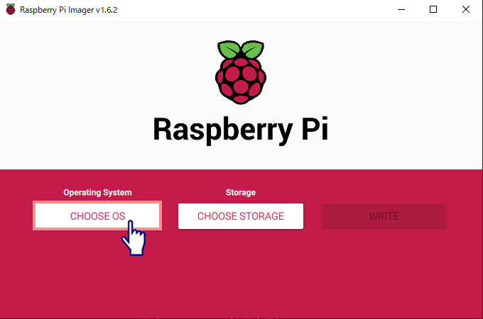

   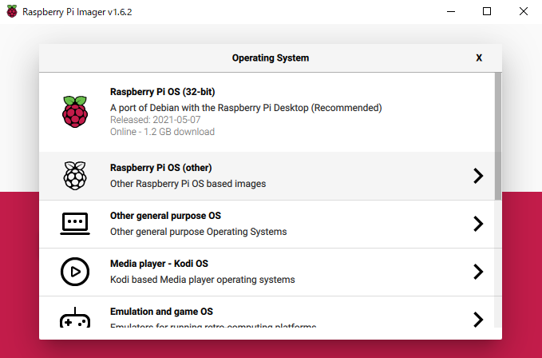

6. [Raspberry Pi OS (other)]をクリックし、[Raspberry Pi OS Lite (32-bit)]を選択

   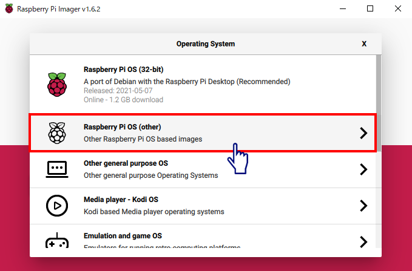

   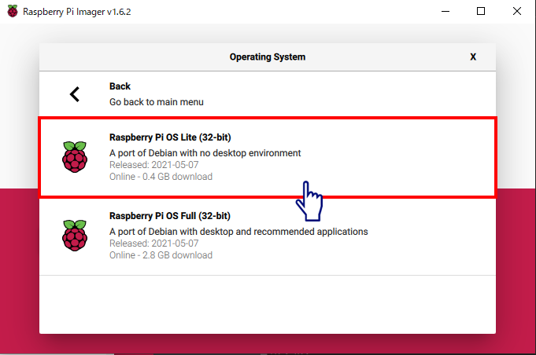

   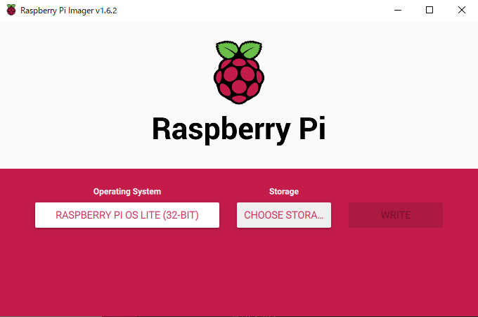

7. [CHOOSE STORAGE]をクリックし、ストレージ選択画面を開く

   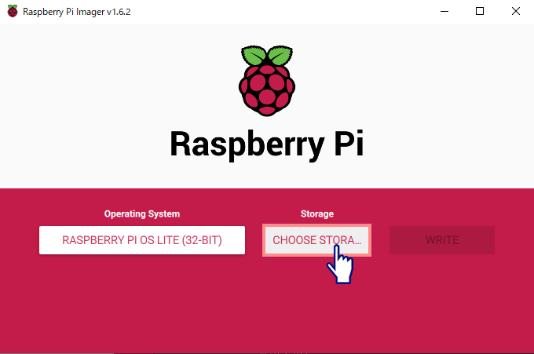

   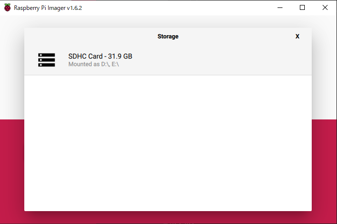

8. SDカードをマウントしているドライブを選択

   この例では[SDHC Card - 31.9 GB] を選択

   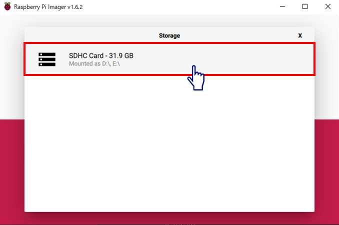

   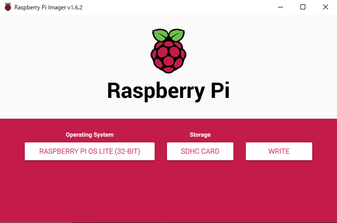

9. 選択内容を確認し、[WRITE]をクリックしてSDカードへデータを書き込む

   

   [WRITE]をクリックすると 以下のような警告が出る場合があるが、[YES]をクリックし続行。

   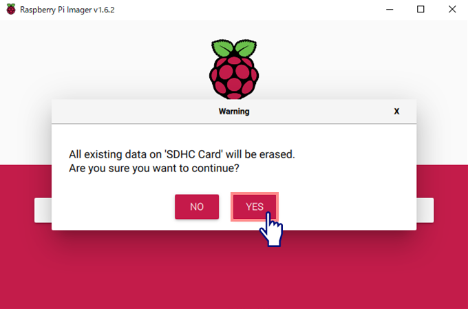

   書き込みが完了すると以下のようなメッセージが表示される。

   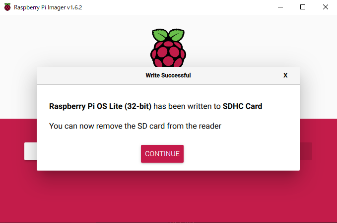
   
   
   
10. 書込PCからmicroSDを取り出す

以上の作業を3回繰り返して、OSをインストールしたmicroSDを3つ用意します。

### 1.3 iPhoneの設定変更

#### 1.3.1 インターネット共有時のSSIDの変更

iPhoneではインターネット共有時のSSIDがデフォルトでは `○○のiPhone` となっており、SSIDに日本語が含まれている状態になっています。
Raspberry Piでは日本語を含んだSSIDのWi-Fiには接続できないため、iPhoneのインターネット共有時のSSIDを変更する必要があります。

SSIDはiPhoneの名前と同一であるため、iPhoneの名前を一時的に変更します。本研修完了後は元に戻してください。


1. ホーム画面から[設定]を開く

   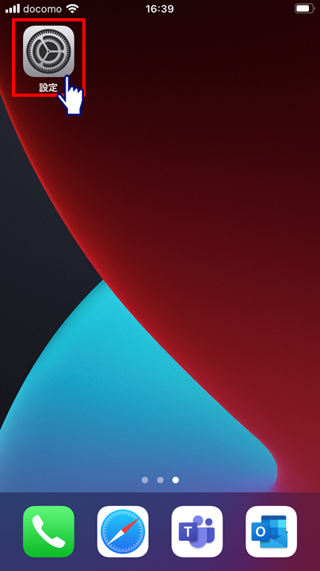 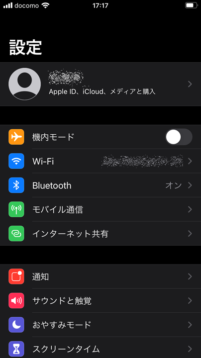

2. [一般]を選択

   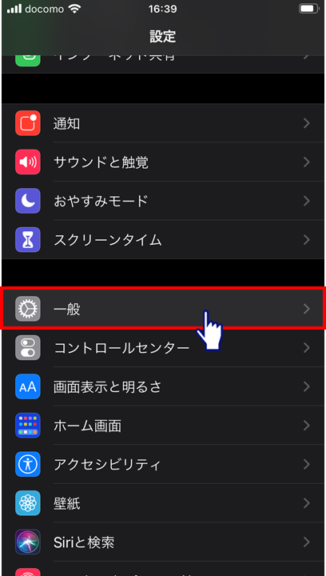 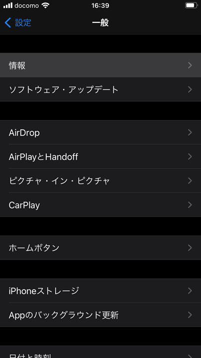

3. [情報]を選択

   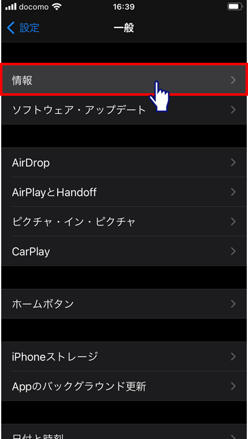 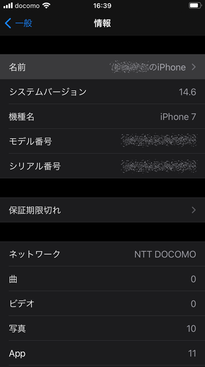

4. [名前]を選択

   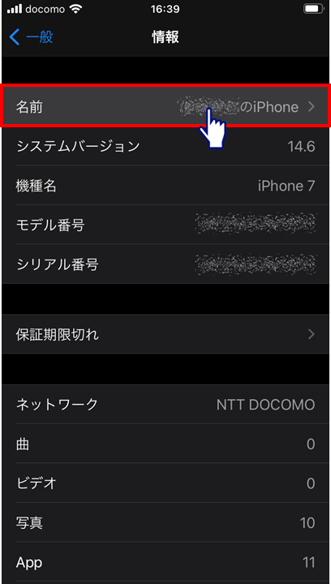 

5. 名前を `raspi-k8s-network` に変更

   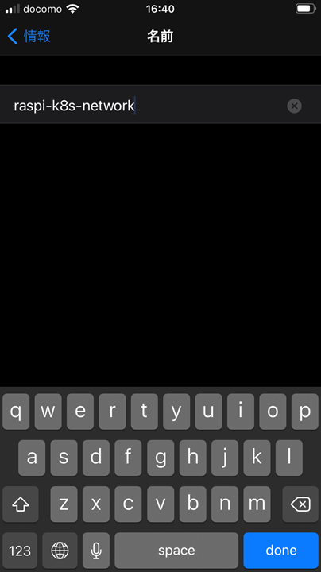 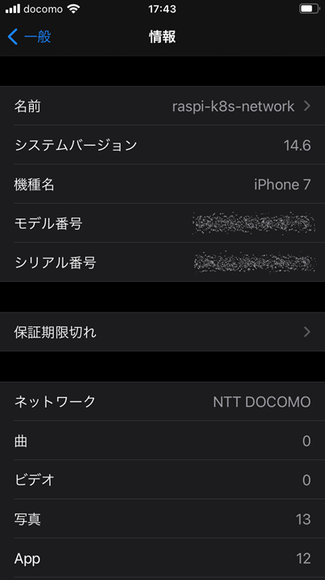

以上で、インターネット共有時のSSIDの変更は完了。

#### 1.3.2 iPhoneのインターネット共有を有効化

1. ホーム画面から[設定]を開く

    

2. [インターネット共有]を選択

   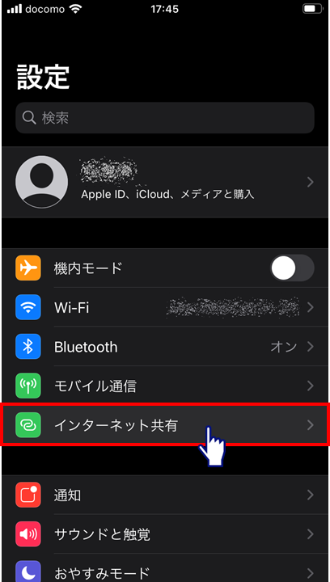 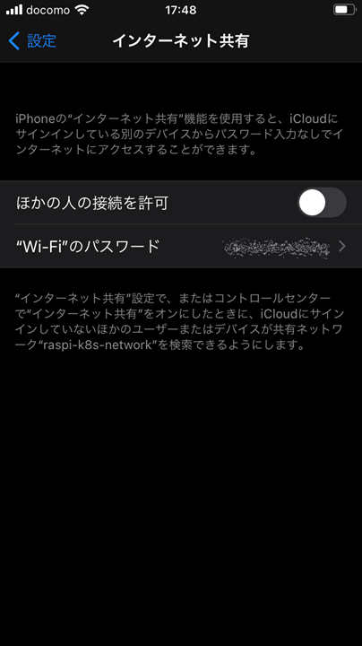

3. [ほかの人の接続を許可]をONに変更

   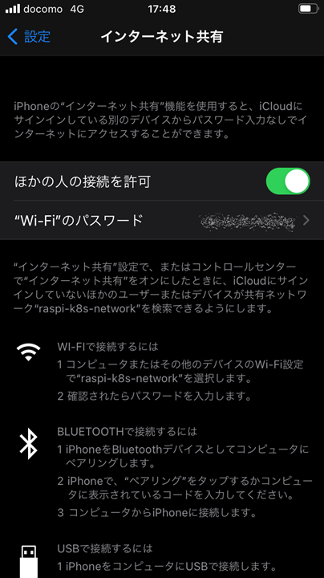 

以上で、インターネット共有の有効化は完了。


## 2. OS (Raspberry Pi OS)の設定変更

Hostnameの設定やWi-Fiへの接続などRaspberry Pi OS の初期設定を実施し、Kubernetesクラスタを構築できる状態にします。

**なお、2.1から2.10までの手順は すべてのノード で実行してください**

以下はOSの初期設定後のイメージ図です。


### 2.1 キーボードレイアウトの変更

デフォルトだとキーボードレイアウトが英語配列になっているので、入力しやすいように日本語配列に変更する。

1. Raspberry PiにmicroSD、ディスプレイ、キーボードを接続し、起動
2. Username: `pi`, Password: `raspberry`でログイン
3. `sudo raspi-config`を実行
4. `5 Localisation Options`を選択
5. `L3 Keyboard`を選択
6. `Generic 105-key PC (intl.)`を選択
7. `Other`を選択
8. `Japanese`を選択
9. `Japanese - Japanese (OADG 109A)`を選択
10. `The default for the keyboard layout`を選択
11. `No compose key`を選択


### 2.2 タイムゾーンの変更

タイムゾーンを日本(`Asia/Tokyo`)に変更します。

2. `5 Localisation Options`を選択
3. `L2 Timezone`を選択
4. `Asia`を選択
5. `Tokyo`を選択
6. `<Finish>`を選択


### 2.3 ハードウェアとOS、Kernelの確認

今回使用しているハードウェア、OS、Kernelバージョンを確認します。

```bash
# Raspberry Piのモデルを確認（個体によってはRev 1.2ではない場合もある）
$ more /proc/device-tree/model
Raspberry Pi 4 Model B Rev 1.2

# OSを確認
$ lsb_release -a
No LSB modules are available.
Distributor ID: Raspbian
Description:    Raspbian GNU/Linux 10 (buster)
Release:        10
Codename:       buster

# Kernelバージョンを確認
$ uname -a
Linux raspberrypi 5.10.52-v71+ #1441 SMP Tue Aug 3 18:11:56 BST 2021 armv71 GNU/Linux
```


### 2.4 ユーザ名とパスワードの変更

Raspberry Piは初期ユーザ/初期パスワードが決まっており、初期ユーザ/初期パスワードのままで運用しているとよくサイバー攻撃の対象となります。
そのため、本演習でもユーザ名とパスワードを変更することで、初期ユーザ/初期パスワードを無効化しています。
本演習では作業の簡素化と統一のためパスワードは極めて簡易なものに設定していますが、本来であればより複雑なパスワードにしたり、公開鍵認証のみ設定したりする方が良いでしょう。

1. 仮ユーザ( `tmp` ユーザ)を作成 
   ※パスワードはユーザ名(`tmp`)と同じものを設定ください

   ```bash
   # ホームディレクトリなしでtmpユーザを作成
   $ sudo useradd -M tmp
   
   # tmpユーザをsudoグループに追加し、sudoの実行権限を付与
   $ sudo gpasswd -a tmp sudo
   Adding user tmp to group sudo
   
   # tmpユーザのパスワードを変更
   $ sudo passwd tmp
   New password: <パスワードを入力>
   Retype new password: <パスワードを入力>
   passwd: password updated successfully
   ```
   
2. Raspberry Piを再起動

   ```bash
   $ sudo reboot
   ```

3. 仮ユーザ(Username: `tmp`, Password: `tmp`)でログイン

4. `pi`ユーザのユーザ名を変更

   ```bash
   # usermod -lでユーザ名をpiからtarteに変更
   $ sudo usermod -l tarte pi
   
   # usermod -dでホームディレクトリを/home/piから/home/tarteに変更
   $ sudo usermod -d /home/tarte -m tarte
   
   # groupmod -nでpiグループをtarteグループに変更
   $ sudo groupmod -n tarte pi
   ```

   ユーザ名が`tarte`、ホームディレクトリが`/home/tarte`へ変更されていることを確認

   ```bash
   $ cat /etc/passwd | grep tarte
   tarte:x:1000:1000:,,,:/home/tarte:/bin/bash
   ```

5. Raspberry Piを再起動

   ```bash
   $ sudo reboot
   ```

6. Username: `tarte`, Password: `raspberry`でログイン

7. 仮ユーザ(`tmp`ユーザ)を削除

   ```bash
   # 仮ユーザを削除
   $ sudo userdel tmp
   ```

   `tmp`ユーザが削除されたことを確認

   ```bash
   # 実行後に何も表示されないことを確認
   $ cat /etc/passwd | grep tmp
   ```

8. tarteユーザのパスワードを変更  
   ※パスワードはユーザ名(`tarte`)と同じものを設定すること

   ```bash
   # tarteユーザのパスワードを変更
   $ sudo passwd tarte
   New password: <パスワードを入力>
   Retype new password: <パスワードを入力>
   passwd: password updated successfully
   ```

9. piユーザのパス無しsudo設定を削除

   ```bash
   $ sudo rm /etc/sudoers.d/010_pi-nopasswd
   ```

10. Raspberry Piを再起動

    ```bash
    $ sudo reboot
    ```


### 2.5 Hostnameの変更

本研修ではMasterノード1台、Workerノード2台の構成で構築するので、各ノードがどの役割なのか識別できるようHostnameを変更します。

1. Username: `tarte`, Password: `tarte`でログイン
2. `sudo raspi-config`を実行
3. `1 System Options`を選択
4. `S4 Hostname`を選択
5. Hostnameに関する注意を確認し、`<Ok>`を選択
6. 変更したいhostnameを入力
   - "raspi-k8s-master"
   - "raspi-k8s-worker01"
   - "raspi-k8s-worker02"
7. `<Ok>`を選択
8. `<Finish>`を選択
9. Rebootの確認が表示されるので、`<Yes>`を選択


### 2.6 swapの無効化

スワップが有効だと kubelet が起動しないので無効化します。

1. Username: `tarte`, Password: `tarte`でログイン

2. swapを無効化

    ```bash
    # swapを無効化
    $ sudo swapoff -a
    $ sudo systemctl disable dphys-swapfile.service
    ```
    
3. swapが無効化されていることを確認

    ```bash
    # 何も表示されなければOK
    $ sudo swapon --show
    ```

    

### 2.7 cgroupsのmemoryサブシステムの有効化

1. memoryサブシステムが有効化されているか確認

   `memory 0`と表示された場合は以降の手順を実施する。`memory 1`と表示された場合は次の章に進む。

   ```bash
   # "memory 0"と表示されらた以降の手順を実施
   # "memory 1"の場合は次の章に進む
   $ cat /proc/cgroups | grep memory | awk '{print $1,$4}'
   memory 0
   ```

2. `/boot/cmdline.txt` を変更する

   ```bash
   # memoryサブシステムを有効化する記述を追記
   $ sudo sed -i "s/$/ cgroup_enable=cpuset cgroup_memory=1 cgroup_enable=memory/" /boot/cmdline.txt
   
   # 追記されていることを確認
   $ cat /boot/cmdline.txt
   console=seria10,115200 console=tty1 root=PARTUUID=efaac79d-02 rootfstype=ext4 elevator=deadline fsck.repair=yes rootwait cgroup_enable=cpuset cgroup_memory=1 cgroup_enable=memory
   ```

3. Raspberry Piを再起動

   ```bash
   $ sudo reboot
   ```

4. Username: `tarte`, Password: `tarte`でログイン

5. memoryサブシステムが有効化されていることを確認

   ```bash
   # "memory 1"と表示されることを確認
   $ cat /proc/cgroups | grep memory | awk '{print $1,$4}'
   memory 1
   ```


### 2.8 Wi-Fi接続とIPアドレス固定化

#### 2.8.1 iPhoneのインターネット共有の設定を確認

iPhoneのインターネット共有は接続している端末がない状態がしばらく続くと自動的にOFFになってしまいます。
本節の設定前にインターネット共有がONになっていることを確認しましょう。

1. ホーム画面から[設定]を開く
   
    
   
2. [インターネット共有]を選択

    

3. [ほかの人の接続を許可]をONになっていることを確認

   "Wi-Fi"のパスワードはこの後使用するのでメモしておくこと。

    


#### 2.8.2 Wi-Fiへの接続とIPアドレスの固定化

1. Username: `tarte`, Password: `tarte`でログイン

2. `sudo raspi-config`を実行

3. `5 Localisation Options`を選択

4. `L4 WLAN Country`を選択

5. `JP Japan`を選択

6. Wi-Fi countryがJPにセットされたことを確認し、`<Ok>`を選択

7. `<Finish>`を選択

8. Rebootの確認が表示されるので、`<No>`を選択

9. wpa_supplicant.confに接続情報を追記

   Raspberry Pi上では $\backslash$​​ (半角バックスラッシュ) と $￥$​ (半角円記号)​​が区別されることに注意すること。
   以下のコマンドで使用しているのはバックスラッシュである。

   ```bash
   # <YOUR_WIFI_PASSWORD> は、各自の内容を指定ください
   $ sudo wpa_passphrase raspi-k8s-network <YOUR_WIFI_PASSWORD> | \
   sed '/#psk=/d' | sudo tee -a /etc/wpa_supplicant/wpa_supplicant.conf
   
   # 実行結果として以下が表示されます。
   network={
       ssid="raspi-k8s-network"
       psk=f9ca578sijd...
   }
   ```

10. `/etc/dhcpcd.conf`の最後に以下を追記

    本演習では`<IP Address>`の部分に以下を指定すること。

    - "raspi-k8s-master"    : 172.20.10.2
    - "raspi-k8s-worker01"  : 172.20.10.3
    - "raspi-k8s-worker02"  : 172.20.10.4

    ```bash
    $ cat << EOF >> /etc/dhcpcd.conf
    interface wlan0
    static ip_address=<IP Address>
    static routers=172.20.10.1
    static domain_name_servers=172.20.10.1
    EOF
    ```

11. Raspberry Piを再起動

    ```bash
    $ sudo reboot
    ```

12. Username: `tarte`, Password: `tarte`でログイン

13. インターネット接続できることを確認

    ```bash
    $ curl -Is www.google.com | head -1
    HTTP/1.1 200 OK
    ```
    
    `HTTP/1.1 200 OK`が表示されなかった場合は、下記2点を確認すること。
    
    - iPhoneのインターネット共有が有効化されている
    - Raspberry PiがiPhoneのインターネット共有に接続できている
    
    iPhoneのインターネット共有が有効化しているのに、Raspberry Piがインターネット接続できない場合はRaspberry Piを再起動してみること。
    
    

### 2.9 各種パッケージの更新

```bash
$ sudo apt update
$ sudo apt upgrade -y
```


### 2.10 SSH サービス起動設定

1. Raspberry Pi起動時にSSHサービスが起動されるように設定

   ```bash
   $ sudo /etc/init.d/ssh restart
   # 再起動後も sshサービスが起動する様に設定
   $ sudo systemctl enable ssh.service
   ```

2. SSHサービスが起動していることを確認

   ```bash
   # SSHサービスが起動している(結果が出力される)ことを確認
   # SSHサービスが起動していない場合は何も出力されない
   $ sudo systemctl status ssh.service | grep "Active: active"
      Active: active (running) since Wed 2021-07-28 14:44:09 51s ago
   ```


※※※※※※※※※※※※※※※※※※※※※※※※※※※※※※※※※※※※※※
※※  **2.1 から 2.10** までの作業は3台分(Master:1台、Worker:2台) 実施ください  ※※ 
※※※※※※※※※※※※※※※※※※※※※※※※※※※※※※※※※※※※※※

## 3. Kubernetesクラスタの構築／初期設定

ここからKubernetesクラスタの構築と初期設定を行います。
以下はKubernetesクラスタ構築および設定後のイメージです。

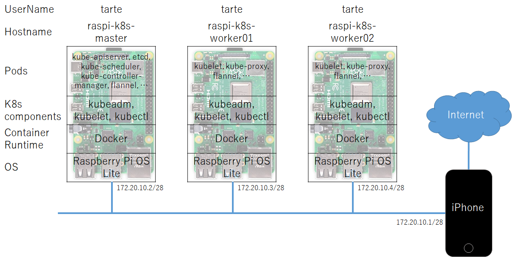

第3章の手順が完了した時点で、Kubernetesとして機能する基本的なクラスタが完成します。

**3.1 - 3.3の作業はすべてのノードで実施してください。**

また、OSの設定が完了したことで各ノード同士はSSHでアクセスできるようになっています。
ディスプレイやキーボードの抜き差しが面倒であれば、以降はSSHで各ノードを切り替えて作業を実施しても構いません。
SSHでノードを切り替える場合は操作対象を間違えないように、プロンプトに表示されるHostnameを確認するなど注意しましょう。

以下は、`raspi-k8s-master` から `raspi-k8s-worker01` に `tarte`ユーザを用いてSSHアクセスする際の例です。

```bash
tarte@raspi-k8s-master:~ $ hostname
raspi-k8s-master

tarte@raspi-k8s-master:~ $ ssh tarte@raspi-k8s-worker01.local
tarte@raspi-k8s-worker01.local's password: <パスワードを入力>
Linux raspi-k8s-worker01 5.10.17-v71+ #1421 SMP Thu May 27 14:00:13 BST 2021 armv71

The programs included with the Debian GNU/Linux system are free software;
the exact distribution terms for each program are described in the
individual files in /usr/share/doc/*/copyright.

Debian GNU/Linux comes with ABSOLUTELY NO WARRANTY, to the extent
permitted by applicable law.
Last login: Sat May  8 01:09:55 2021

tarte@raspi-k8s-worker01:~ $ hostname
raspi-k8s-worker01
```

あるノードからあるノードへ初めてSSHする際は、以下のようなメッセージが表示されます。
この場合は指示通り、`yes` を入力すればよいです。

````bash
The authenticity of host 'raspi-k8s-worker01.local (172.20.10.3)' can't be established.
ECDSA key fingerprint is SHA256:8aCrchTAadVjjK50I+PiV85T7Jh6FpFs1VBjpUj307E.
Are you sure you want to continue connecting (yes/no)? <yesを入力>
````

### 3.1 コンテナランタイム(docker)のインストール

コンテナランタイムとは、簡単に言えばコンテナを操作・管理するために必要なソフトウェアです。
Kubernetesはコンテナランタイムを介して各種コンテナをオーケストレーションしています。

Kubernetesは、[docker](https://www.docker.com/),  [containerd](https://containerd.io/), [cri-o](https://cri-o.io/) といったコンテナランタイムをサポートしています。

本研修ではコンテナランタイムとして docker をインストールしていきます。

1. `docker` をインストール

   ```bash
   # dockerをインストール
   $ curl -sSL https://get.docker.com | sh
   # tarteユーザでDockerを実行できるよう、dockerグループに追加
   $ sudo usermod -aG docker tarte
   ```

2. `docker` がインストールされたことを確認

   ```bash
   # 以下の出力は例であるため、実際の出力とは異なる場合がある
   $ docker --version
   Docker version 20.10.7, build f0df350
   ```

### 3.2 kubeadm, kubectl, kubeletのインストール

Kubernetesの構築・運用に必要なパッケージをインストールします。

1. `iptables`のバックエンドとして`nftables`を使用しないように変更

   Raspberry Pi OSでは、デフォルトで`iptables`のバックエンドに`nftables`を使用しています。
   しかし、Kubernetesは`nftables`に対応していないので、`iptables`のレガシーバージョンが動作するように切り替える必要があります。

   ```bash
   # iptablesnのレガシーバイナリをインストール
   $ sudo apt install -y iptables arptables ebtables

   # iptablesのバックエンドとして、iptablesが動作するように変更
   $ sudo update-alternatives --set iptables /usr/sbin/iptables-legacy
   $ sudo update-alternatives --set ip6tables /usr/sbin/ip6tables-legacy
   $ sudo update-alternatives --set arptables /usr/sbin/arptables-legacy
   $ sudo update-alternatives --set ebtables /usr/sbin/ebtables-legacy
   ```

2. `kubeadm`, `kubelet`, `kubectl`をインストール

   ```bash
   # 鍵登録
   $ curl -s https://packages.cloud.google.com/apt/doc/apt-key.gpg | \
   sudo apt-key add -
   
   # apt のソースリストに Kubernetes関連のパッケージを提供しているリポジトリを追加
   $ cat << EOF | sudo tee /etc/apt/sources.list.d/kubernetes.list
   deb https://apt.kubernetes.io/  kubernetes-xenial main
   EOF
   
   # apt を更新し、Kubernetesのモジュールの情報を取得
   $ sudo apt update
   
   # Kubernetes の各パッケージをインストール
   $ sudo apt install -y kubelet=1.21.3-00 kubeadm=1.21.3-00 kubectl=1.21.3-00
   
   # kubelet kubeadm kubectlのバージョンを固定
   $ sudo apt-mark hold kubelet kubeadm kubectl
   ```
   
3. `kubeadm`, `kubelet`, `kubectl` がインストールされたことを確認

   ```bash
   # kubelet バージョン確認
   $ kubelet --version
   Kubernetes v1.21.3
   # kubeadm バージョン確認
   $ kubeadm version -o short
   v1.21.3
   # kubectl バージョン確認
   $ kubectl version --short --client
   Client Version: v1.21.3
   ```
   


### 3.3 コマンドの補完機能の有効化

`kubectl` と `kubeadm` の補完機能を有効化します。補完機能を有効にすることで、コマンド入力中にTabキーで入力を補完できるようになります。

1. `.kube`ディレクトリを作成

   ```bash
   $ mkdir -p ~/.kube
   ```
   
2. 補完コードをファイルに出力

   ```bash
   $ kubectl completion bash > ~/.kube/kubectl_completion.bash.inc
   
   $ kubeadm completion bash > ~/.kube/kubeadm_completion.bash.inc
   ```

3. 補完コードのファイルを`.profile`で読み込むように変更

   Raspberry Pi上では $\backslash$ (半角バックスラッシュ) と $￥$ (半角円記号)が区別されることに注意すること。
   以下のコマンドで使用しているのはバックスラッシュである。

   ```bash
   $ printf "\n# Kubectl shell completion
   source ~/.kube/kubectl_completion.bash.inc\n" >> ~/.profile
   
   $ printf "\n# Kubeadm shell completion
   source ~/.kube/kubeadm_completion.bash.inc\n" >> ~/.profile
   ```

4. ノードを再起動

   ```bash
   $ sudo reboot
   ```


※※※※※※※※※※※※※※※※※※※※※※※※※※※※※※※※※※
※※　**3.3** までの作業は3台分(Master:1台、Worker:2台)実施ください　※※
※※※※※※※※※※※※※※※※※※※※※※※※※※※※※※※※※※

### 3.4 Kubernetesクラスタの構築

Kubernetesクラスタを構築していきます。

以降の手順では、文頭に明記されたノードで作業を実施してください。

1. (Master) Masterノードを初期化

   Masterノードを初期化します。 
   合わせてクラスタ内のPodが使用するネットワークアドレスを指定します。  

   ```bash
   # CNIにflannelを使用するため、10.244.0.0/16を指定
   $ sudo kubeadm init --pod-network-cidr=10.244.0.0/16
   ```

   Masterノードの初期化に成功すると次のようなメッセージが表示されます。 

   ```bash
   Your Kubernetes control-plane has initialized successfully!
   
   To start using your cluster, you need to run the following as a regular user:
   
     mkdir -p $HOME/.kube
     sudo cp -i /etc/kubernetes/admin.conf $HOME/.kube/config
     sudo chown $(id -u):$(id -g) $HOME/.kube/config
   
   You should now deploy a pod network to the cluster.
   Run "kubectl apply -f [podnetwork].yaml" with one of the options listed at:
   https://kubernetes.io/docs/concepts/cluster-administration/addons/
   
   Then you can join any number of worker nodes by running the following on each as root:
   kubeadm join 172.20.10.2:6443 --token 1gettp.t0tchwj82mg2qfbq \
    --discovery-token-ca-cert-hash sha256:2608eeb6840cde591b744ee0a3ecbe8d9278096a730f91d26c4e47d3d0788ebb2
   ```

2. (Master) tokenをファイルに出力

   ```bash
   # tokenを出力
   $ sudo kubeadm token list -o jsonpath='{.token}' > ~/token
   
   # tokenがファイルに出力できていることを確認
   # 以下の出力は例であり、実際は各自の出力結果とは異なる
   $ cat ~/token
   1gettp.t0tchwj82mg2qfbq
   ```
   
3. (Master) CA証明書のハッシュ値をファイルに出力

   ```bash
   # CA証明書のハッシュ値を出力
   $ openssl x509 -pubkey -in /etc/kubernetes/pki/ca.crt | \
   openssl rsa -pubin -outform der 2>/dev/null | \
   openssl dgst -sha256 -hex | sed 's/^.* //' > ~/ca-cert-hash
   
   # CA証明書のハッシュ値がファイルに出力できていることを確認
   # 以下の出力は例であり、実際は各自の出力結果とは異なる
   $ cat ~/ca-cert-hash
   2608eeb6840cde591b744ee0a3ecbe8d9278096a730f91d26c4e47d3d0788ebb2
   ```

4. (Master) `kubectl` の設定ファイルをコピー

   `kubectl` でクラスタにアクセスして各種操作を実行するには認証情報を含んだ設定ファイルが必要になります。
   `kubeadm init` が完了すると設定ファイルが生成されるので、それを所定のディレクトリ(`~/.kube/`)にコピーします。

   ```bash
   $ sudo cp /etc/kubernetes/admin.conf ~/.kube/config
   $ sudo chown $(id -u):$(id -g) ~/.kube/config
   ```

   `~/.kube` 配下に config ファイルがコピーされていること、所有者とグループが `tarte`になっていることを確認します。

   ```bash
   $ ls -l ~/.kube/config
   -rw------- 1 tarte tarte 5595 Jul 29 10:24 /home/tarte/.kube/config
   ```

5. (Master) 出力したファイルをWorkerノードに転送

   ```bash
   # raspi-k8s-worker01にファイルを転送
   $ scp  ~/token ~/ca-cert-hash ~/.kube/config tarte@raspi-k8s-worker01.local:/home/tarte/
   # raspi-k8s-worker02にファイルを転送
   $ scp  ~/token ~/ca-cert-hash ~/.kube/config tarte@raspi-k8s-worker02.local:/home/tarte/
   ```

6. (Master) `kubectl` でリソースの情報を取得できることを確認

   ```bash
   # この時点ではMasterノードはNotReadyのまま
   $ kubectl get node
   NAME                STATUS      ROLES                  AGE    VERSION
   raspi-k8s-master    NotReady    control-plane,master   36m    v1.21.3
   ```

7. (Master) コンテナ間通信を実現する flannel をデプロイ

   flannel はコンテナ間通信を実現するためのContainer Network Interface(CNI)です。
   Kubernetesは様々なPod（コンテナ）が連携して動作しています。
   そのため、flannel などのCNIを構築するまではコンテナ同士の通信ができない（＝コンテナが連携できない）ので、`raspi-k8s-master`が **NotReady**となっています。

   flannel デプロイ後のネットワーク図は以下のようになっています。

   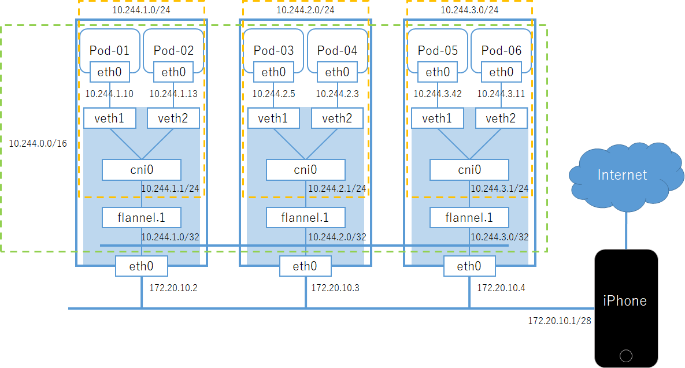

   以下のコマンドを実行することで、flannelをデプロイすることができます。

   ```bash
   $ kubectl apply -f \
   https://raw.githubusercontent.com/coreos/flannel/master/Documentation/kube-flannel.yml
   ```

8. (Master) すべてのPodが **Ready** になることを確認

   下記コマンドを実行すると、すべてのPodが **Ready** になるまで待機します。
   すべてのPodが **Ready** になるとコマンドが完了し、プロンプトが返ってきます。

   ```bash
   # すべてのPodがReadyになるまで待機
   # 以下の出力は例であり、実際は各自の出力結果とは異なる
   $ kubectl wait pod -A --all --for=condition=Ready --timeout=5m
   pod/coredns-558bd4d5db-2vcsl condition met
   pod/coredns-558bd4d5db-xfpwd condition met
   pod/etcd-raspi-k8s-master condition met
   pod/kube-apiserver-raspi-k8s-master condition met
   pod/kube-controller-manager-raspi-k8s-master condition met
   pod/kube-flannel-ds-zj23q condition met
   pod/kube-proxy-pv4fn condition met
   pod/kube-scheduler-raspi-k8s-master condition met
   ```

9. (Master) Masterノードが` **Ready** `になっていることを確認

   ```bash
   # この時点ではMasterノードがReadyになる
   $ kubectl get nodes
   NAME                STATUS    ROLES     AGE   VERSION
   raspi-k8s-master    Ready     master    12m   v1.21.3
   ```

10. (Worker01, Worker02) `kubectl` の設定ファイルを所定のディレクトリに移動

    **Worker01とWorker02のそれぞれで実行してください**

    ```bash
    # 所定のディレクトリに移動
    $ mv ~/config ~/.kube/config
    
    # 権限を変更
    $ sudo chown $(id -u):$(id -g) ~/.kube/config
    ```

    `~/.kube` 配下に config ファイルがコピーされていること、所有者とグループが `tarte`になっていることを確認します。

    ```bash
    $ ls -l ~/.kube/config
    -rw------- 1 tarte tarte 5595 Jul 29 10:24 /home/tarte/.kube/config
    ```

11. (Worker01, Worker02) `kubeadm join`を実行し、Kubernetesクラスタに参加

    **Worker01とWorker02のそれぞれで実行してください**

    ```bash
    $ sudo kubeadm join 172.20.10.2:6443 --token $(cat ~/token) \
    --discovery-token-ca-cert-hash sha256:$(cat ~/ca-cert-hash)
    ```

    以下のようなメッセージが表示されることを確認

    ```bash
    This node has joined the cluster:
    * Certificate signing request was sent to apiserver and a response was received.
    * The Kubelet was informed of the new secure connection details.
    
    Run 'kubectl get nodes' on the control-plane to see this node join the cluster.
    ```

12. (Master) Worker01, Worker02が **Ready** になることを確認

    下記コマンドを実行すると、すべてのWorkerノードが **Ready** になるまで待機します。
    すべてのWorkerノードが **Ready** になるとコマンドが完了し、プロンプトが返ってきます。

    ```bash
    # すべてのWorkerノードがReadyになるまで待機
    $ kubectl wait node -l node-role.kubernetes.io/master!="" --for=condition=Ready --timeout=5m
    node/raspi-k8s-worker01 condition met
    node/raspi-k8s-worker02 condition met
    
    # 実際にWorkerノードがReadyになっていることを確認
    $ kubeactl get node
    NAME                 STATUS   ROLES                  AGE   VERSION
    raspi-k8s-master     Ready    control-plane,master   46m   v1.21.3
    raspi-k8s-worker01   Ready    <none>                 12m   v1.21.3
    raspi-k8s-worker02   Ready    <none>                 10m   v1.21.3
    ```

13. (Master) Workerノードに役割を表すラベルを付与

    ```bash
    $ kubectl label node raspi-k8s-worker01  node-role.kubernetes.io/worker=
    node/raspi-k8s-worker01 labeled
    
    $ kubectl label node raspi-k8s-worker02  node-role.kubernetes.io/worker=
    node/raspi-k8s-worker02 labeld
    ```

14. (Master) 役割を表すラベルが付与されたことを確認

    役割を表すラベルを付与すると、ROLES列に役割が表示されるようになる。

    ```bash
    $ kubectl get node
    NAME                 STATUS   ROLES                  AGE   VERSION
    raspi-k8s-master     Ready    control-plane,master   64m   v1.21.3
    raspi-k8s-worker01   Ready    worker                 30m   v1.21.3
    raspi-k8s-worker02   Ready    worker                 27m   v1.21.3
    ```

15. (Master) MasterにもPodをスケジュールできるように変更

    通常、Masterノードには特別なPodしかスケジュールできないようになっています。
    しかし、Raspberry Piでは使用できるリソースが少なく、Workerノード2台だけだとリソース不足になる可能性があります。

    そこで 3台のRaspberry Piのリソースを最大限利用するために、MasterノードにもPodをスケジュールできるように変更します。

    ```bash
    $ kubectl taint nodes  raspi-k8s-master node-role.kubernetes.io/master-
    node/raspi-k8s-master untainted
    ```


以上でKubernetesクラスタの構築は完了です。

## 4. Kubernetesクラスタを運用しよう

ここからは、構築したKuebernetesクラスタを用いて、Kubernetesの初歩的な運用や動きについて体験しましょう。

以降の手順では、Masterノード(`raspi-k8s-master`)でコマンドを実行していきます。

### 4.1 事前準備

以降の手順ではマニフェストと呼ばれるテキストファイルを作成したり編集したりします。

ただ、Raspberry Piの環境ですべて手入力するのは大変なので、以降の手順で使用するマニフェストはすべてGitHubに公開しています。

まずは必要なコマンドやファイルをダウンロードしていきましょう。

1. `git`コマンドのインストール

   ```bash
   $ sudo apt intall -y git
   ```

2. Masterノードを再起動

   ```bash
   $ sudo reboot
   ```

3. MasterノードにUsername: `tarte`, Password: `tarte`でログイン

4. 必要なファイルをダウンロード

   ```bash
   $ git clone https://github.com/senimagan/raspi-k8s-training.git
   ```

5. 必要なファイルがダウンロードできていることを確認

   ```bash
   $ ls -l raspi-k8s-training
   total 720
   drwxr-xt-x 10 tarte tarte   4096 Aug 23 18:19 manifests
   drwxr-xt-x  2 tarte tarte   4096 Aug 23 18:19 raspi-k8s-training-materials_r1.assets
   -rw-r--t--  1 tarte tarte 646511 Aug 23 18:19 raspi-k8s-training-materials_r1.html
   -rwxr-xt-x  1 tarte tarte  78644 Aug 23 18:19 raspi-k8s-training-materials_r1.md
   
   $ ls -l raspi-k8s-trining/manifests/
   total 36
   drwxr-xt-x 10 tarte tarte 4096 Aug 23 18:19 4.2
   drwxr-xt-x 10 tarte tarte 4096 Aug 23 18:19 4.4
   drwxr-xt-x 10 tarte tarte 4096 Aug 23 18:19 4.5
   drwxr-xt-x 10 tarte tarte 4096 Aug 23 18:19 4.6
   -rw-r--t--  1 tarte tarte 1160 Aug 23 18:19 readme.txt
   ```


### 4.2 コンテナアプリケーションのデプロイ

Kubernetesではマニフェストと呼ばれるテキストファイルを適用することでアプリケーションをデプロイしたり、その他リソースを設定・運用したりします。

マニフェストには各種リソースの設定・状態が宣言的に記述されており、Kubernetesがその通りに管理することでコンテナアプリケーションのデプロイやサービスの公開といったことが可能になっています。

このようにインフラを命令的なプロセスで管理するのではなく、宣言的に記述したコードを用いて管理する手法を **Infrastructure as Code (IaC)** といいます。

Kubernetesは命令的な操作も可能ですが、内部ではIaCで管理されています。

実は コンテナアプリケーションやリソースのデプロイは flannel の構築で実践しているのですが、改めて体験してみましょう。
今回は、Apache(httpd)のアプリケーションをデプロイします。

1. Apacheのコンテナアプリケーションを表すDevelopmentのマニフェストを作成

   以下のマニフェストはApacheのPodを5個維持するようなDeploymentを定義しています。

   ```bash
   $ cat << EOF > /tmp/apache-deploy.yaml
   apiVersion: apps/v1
   kind: Deployment
   metadata:
     labels:
       app: apache
     name: apache
     namespace: default
   spec:
     replicas: 5
     selector:
       matchLabels:
         app: apache
     template:
       metadata:
         labels:
           app: apache
       spec:
         containers:
         - name: apache-container
           image: httpd:alpine
           ports:
           - containerPort: 80
   EOF
   ```

   手入力が面倒な場合は、以下のディレクトリにあるマニフェストを使用してください。

   ```bash
   $ ls -l ~/raspi-k8s-training/manifests/4.2/apache-deploy.yaml
   $ cp ~/raspi-k8s-training/manifests/4.2/apache-deploy.yaml ~/apache-deploy.yaml
   ```

   

2. 作成したマニフェストを適用してApacheをデプロイ

   ```bash
   $ kubectl apply -f ~/apache-deploy.yaml
   deployment.apps/apache created
   ```

   

3. ApacheのDeploymentがAvailableになるまで待機

   ```bash
   # すべてのApache PodがReadyになるまで待機
   $ kubectl wait pod -l app=apache --for=condition=Ready --timeout=5m
   pod/apache-56654d682d-4xb2q condition met
   pod/apache-56654d682d-cxzdd condition met
   pod/apache-56654d682d-s1jdo condition met
   pod/apache-56654d682d-disa9 condition met
   pod/apache-56654d682d-42lgi condition met
   
   # すべてのApache PodがReadyになっていることを確認
   $ kubectl get pod -l app=apache
   NAME                      READY   STATUS    RESTARTS   AGE
   apache-56654d682d-4xb2q   1/1     Running   0          7m51s
   apache-56654d682d-cxzdd   1/1     Running   0          7m51s
   apache-56654d682d-s1jdo   1/1     Running   0          7m51s
   apache-56654d682d-disa9   1/1     Running   0          7m51s
   apache-56654d682d-42lgi   1/1     Running   0          7m51s
   
   # Apache Deploymentを確認
   $ kubectl get deploy -l app=apache
   NAME     READY   UP-TO-DATE   AVAILABLE   AGE
   apache   5/5     5            5           8m21s
   ```

マニフェストを適用しただけで複数のアプリケーション（Pod）がデプロイされたことが分かると思います。

今回はDeploymentのみを適用しましたが、他の様々なリソースも同様にマニフェストを記述してデプロイするという部分は共通しています。

### 4.3 コンテナアプリケーションの手動スケールイン/スケールアウト

先ほどはレプリカ(Pod)が5つのDeploymentを作成しました。次はその数を変更してみましょう。

1. 現在のApacheのレプリカ数を確認

   ```bash
   # Apache Deploymentの状態を確認
   $ kubectl get deploy/apache
   NAME     READY   UP-TO-DATE   AVAILABLE   AGE
   apache   5/5     5            5           12m
   
   # Podの数も確認
   $ kubectl get pod -l app=apache
   NAME                      READY   STATUS    RESTARTS   AGE
   apache-56654d682d-42lgi   1/1     Running   0          13m
   apache-56654d682d-4xb2q   1/1     Running   0          13m
   apache-56654d682d-cxzdd   1/1     Running   0          13m
   apache-56654d682d-disa9   1/1     Running   0          13m
   apache-56654d682d-s1jdo   1/1     Running   0          13m
   ```

2. ApacheのDeploymentをスケールアウト（レプリカ数を増やす）

   ```bash
   $ kubectl scale deploy/apache --replicas=8
   deployment.apps/apache scaled
   ```

3. スケールアウト後のレプリカ数を確認

   ```bash
   # スケールアウト後のApache Deploymentの状態を確認
   $ kubectl get deploy/apache
   NAME     READY   UP-TO-DATE   AVAILABLE   AGE
   apache   8/8     8            8           16m
   
   # Podの数も確認
   # AGEが若いPodが増えていることが分かる
   $ kubectl get pod -l app=apache
   NAME                      READY   STATUS    RESTARTS   AGE
   apache-56654d682d-42lgi   1/1     Running   0          13m
   apache-56654d682d-4xb2q   1/1     Running   0          13m
   apache-56654d682d-cxzdd   1/1     Running   0          13m
   apache-56654d682d-d2f4s   1/1     Running   0          2m24s
   apache-56654d682d-disa9   1/1     Running   0          13m
   apache-56654d682d-s1jdo   1/1     Running   0          13m
   apache-56654d682d-xjrww   1/1     Running   0          2m24s
   apache-56654d682d-z94sx   1/1     Running   0          2m24s
   ```

4. ApacheのDeploymentをスケールイン（レプリカ数を減らす）

   ```bash
   $ kubectl scale deploy/apache --replicas=5
   deployment.apps/apache scaled
   ```

5. スケールイン後のレプリカ数を確認

   ```bash
   # スケールイン後のApache Deploymentの状態を確認
   $ kubectl get deploy/apache
   NAME     READY   UP-TO-DATE   AVAILABLE   AGE
   apache   5/5     5            5           20m
   
   # Podの数も確認
   # Podが5つに減っていることが分かる
   $ kubectl get pod -l app=apache
   NAME                      READY   STATUS    RESTARTS   AGE
   apache-56654d682d-4xb2q   1/1     Running   0          22m
   apache-56654d682d-cxzdd   1/1     Running   0          22m
   apache-56654d682d-d2f4s   1/1     Running   0          11m
   apache-56654d682d-s1jdo   1/1     Running   0          22m
   apache-56654d682d-z94sx   1/1     Running   0          11m
   ```


このように、Kubernetesでは簡単にアプリケーション(Pod)の数を増減することができます。
今回は説明しませんが、CPU使用率に合わせて自動的にスケールイン/スケールアウトするという機能もあります。

Podの数を適切に変更することで、負荷を複数のPodに分散させることができ、安定してアプリケーションを稼働させることができるようになります。


### 4.4 コンテナアプリケーションの自己修復

Kubernetesの大きな特徴の一つに「自己修復(Self-healing)」という機能があります。
[Kubernetesが必要な理由と提供する機能 - Kuberentesとは何か？ | Kubernetes](https://kubernetes.io/ja/docs/concepts/overview/what-is-kubernetes/#why-you-need-kubernetes-and-what-can-it-do)

自己修復の代表的な例として、「常にPod（コンテナ）の数を維持する」というものがあります。
これにより、KubernetesではPodが異常終了してしまった場合やノードに異常が発生した場合でもコンテナアプリケーションを維持することができ、高可用性を実現できます。

この章では、意図的に障害を発生させて、Kubernetesが障害発生時にどのような動作をするのか実際に確認してみましょう。

#### 4.4.1 Podが異常終了した場合の自己修復

まずは、Podが異常終了した場合の動作を確認してみましょう。
今回は意図的にPodを1つ削除して障害を再現します。

1. 削除対象のPodを決める

   ```bash
   # 以下は`kubectl get pod`実行時に
   # 一番上に表示されるPodの名前を取得するコマンド
   $ TARGET=$(kubectl get pod | grep apache | head -1 | awk '{print $1}')
   
   $ echo ${TARGET}
   apache-56654d682d-4xb2q
   ```

2. Podを削除後、`watch`コマンドで経過を観察

   `watch`コマンドは `Ctrl + C` で終了することができます。

   ```bash
   # 対象Podの削除し、経過を観察
   $ kubectl delete pod ${TARGET} --wait=false; watch kubectl get pod
   ```


削除後の動きを観察すると、対象のPodの削除が削除されると同時に、新たなPodが追加されたことが確認できたと思います。
これはあるべき状態（マニフェストに記載されたレプリカ数）と現在の状態（現在のレプリカ数）が一致しなくなったため、Kubernetesがあるべき状態に戻した（Podを自己修復した）ためです。

このようにKubernetesではDeploymentのいくつかのPodが異常終了しても、すぐに自己修復されるので高い可用性を実現することができます。

簡単に図で表すと以下のようなイメージ。

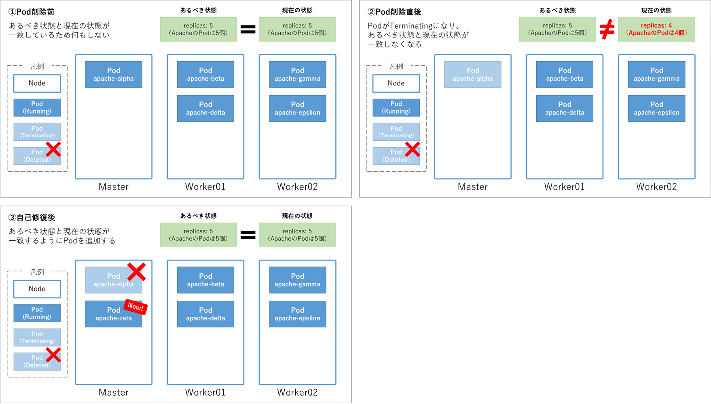


#### 4.4.2 ノードに障害が発生した場合の自己修復

次にPodがデプロイされているノードに障害が発生した場合の動作を確認してみましょう。

今回は意図的にWorkerノードの電源を落とすことで、障害を発生させます。

1. ApacheのDeploymentの設定を変更

   ```bash
   # 変更箇所の確認
   # 行頭に+がついている行が apache-deploy-selfheal.yamlで追加された行
   # デフォルトだとノードに障害が発生してから5分経過しないとPodが退避しないので、
   # 今回はわかりやすいようにその時間を10秒にしている。
   $ cd ~/raspi-k8s-training/manifests/
   $ diff -u ./4.2/apachce-deploy.yaml ./4.4/apache-deploy-selfheal.yaml
   --- ./4.2/apachce-deploy.yaml  2021-08-19 10:20:24.647078676 +0900
   +++  ./4.4/apache-deploy-selfheal.yaml 2021-08-19 10:19:30.723446276 +0900
   @@ -20,4 +20,13 @@
            image: httpd:alpine
            ports:
            - containerPort: 80
   +      tolerations:
   +      - effect: NoExecute
   +        key: node.kubernetes.io/unreachable
   +        operator: Exists
   +        tolerationSeconds: 10
   +      - effect: NoExecute
   +        key: node.kubernetes.io/not-ready
   +        operator: Exists
   +        tolerationSeconds: 10
   
   # tolerationsの設定を追加
   $ kubectl apply -f  ./4.4/apache-deploy-selfheal.yaml
   deployment.apps/apache configured
   ```

   

2. `watch` コマンドでノードとPodの状況を監視

   ```bash
   $ watch "kubectl get node; echo; kubectl get pod -l app=apache -owide"
   ```

   この時点では以下のような状況。障害発生時の様子を観察するためコマンドは実行したままにする。

   ```bash
   NAME                 STATUS   ROLES                  AGE   VERSION
   raspi-k8s-master     Ready    control-plane,master   27h   v1.21.3
   raspi-k8s-worker01   Ready    worker                 26h   v1.21.3
   raspi-k8s-worker02   Ready    worker                 26h   v1.21.3
   
   NAME                      READY   STATUS    RESTARTS   AGE   IP            NODE                 NOMINATED NODE   READINESS GATES
   apache-595db6fcbb-7gpwb   1/1     Running   0          10m   10.244.1.53   raspi-k8s-worker01   <none>           <none>
   apache-595db6fcbb-7vr9p   1/1     Running   0          10m   10.244.2.70   raspi-k8s-worker02   <none>           <none>
   apache-595db6fcbb-g8j7m   1/1     Running   0          10m   10.244.2.71   raspi-k8s-worker02   <none>           <none>
   apache-595db6fcbb-gkrpc   1/1     Running   0          10m   10.244.0.22   raspi-k8s-master     <none>           <none>
   apache-595db6fcbb-w7969   1/1     Running   0          10m   10.244.1.54   raspi-k8s-worker01   <none>           <none>
   ```

   

3. `raspi-k8s-worker02` NodeのRaspberry Piから電源ケーブルを抜く

   **誤って `raspi-k8s-master` Nodeの電源を抜かないように注意すること**

   Kubernetesは40秒以上疎通が取れなくなった場合にそのノードを **NotReady** と判断するため、`raspi-k8s-worker02` Nodeの電源ケーブルを抜いてもすぐには **NotReady** にはなりません。

   40秒以上経過すると、まず `raspi-k8s-worker02`  Nodeが **NotReady** に変化します。

   ```bash
   NAME                 STATUS     ROLES                  AGE   VERSION
   raspi-k8s-master     Ready      control-plane,master   27h   v1.21.3
   raspi-k8s-worker01   Ready      worker                 26h   v1.21.3
   raspi-k8s-worker02   NotReady   worker                 26h   v1.21.3
   
   NAME                      READY   STATUS    RESTARTS   AGE   IP            NODE                 NOMINATED NODE   READINESS GATES
   apache-595db6fcbb-7gpwb   1/1     Running   0          11m   10.244.1.53   raspi-k8s-worker01   <none>           <none>
   apache-595db6fcbb-7vr9p   1/1     Running   0          11m   10.244.2.70   raspi-k8s-worker02   <none>           <none>
   apache-595db6fcbb-g8j7m   1/1     Running   0          11m   10.244.2.71   raspi-k8s-worker02   <none>           <none>
   apache-595db6fcbb-gkrpc   1/1     Running   0          11m   10.244.0.22   raspi-k8s-master     <none>           <none>
   apache-595db6fcbb-w7969   1/1     Running   0          11m   10.244.1.54   raspi-k8s-worker01   <none>           <none>
   ```

   次に `raspi-k8s-worker02` Nodeが **Not Ready** になってから約10秒経過すると、 `raspi-k8s-worker02` NodeにデプロイされていたPodが **Terminating** になります。それと同時にレプリカ数を保つために他ノードでPodが起動していることが確認できると思います。

   ```bash
   NAME                 STATUS     ROLES                  AGE   VERSION
   raspi-k8s-master     Ready      control-plane,master   27h   v1.21.3
   raspi-k8s-worker01   Ready      worker                 26h   v1.21.3
   raspi-k8s-worker02   NotReady   worker                 26h   v1.21.3
   
   NAME                      READY   STATUS        RESTARTS   AGE     IP            NODE                 NOMINATED NODE   READINESS GATES
   apache-595db6fcbb-5g2ws   1/1     Running       0          2m38s   10.244.1.56   raspi-k8s-worker01   <none>           <none>
   apache-595db6fcbb-7gpwb   1/1     Running       0          13m     10.244.1.53   raspi-k8s-worker01   <none>           <none>
   apache-595db6fcbb-7vr9p   1/1     Terminating   0          13m     10.244.2.70   raspi-k8s-worker02   <none>           <none>
   apache-595db6fcbb-8cqxd   1/1     Running       0          2m38s   10.244.1.55   raspi-k8s-worker01   <none>           <none>
   apache-595db6fcbb-g8j7m   1/1     Terminating   0          13m     10.244.2.71   raspi-k8s-worker02   <none>           <none>
   apache-595db6fcbb-gkrpc   1/1     Running       0          13m     10.244.0.22   raspi-k8s-master     <none>           <none>
   apache-595db6fcbb-w7969   1/1     Running       0          13m     10.244.1.54   raspi-k8s-worker01   <none>           <none>
   ```

    `raspi-k8s-worker02` NodeにデプロイされていたPodは本来削除されるはずですが、既に `raspi-k8s-worker02` Nodeとは疎通できない状態になっているため、削除処理が完了せずに残ったままになります。

4. `raspi-k8s-worker02` NodeのRaspberry Piから電源ケーブルを接続する

   電源を入れてから約1分ほど経過すると `raspi-k8s-worker02` Nodeが **Ready** に戻ります。
   NotReadyの状態が続くようであれば、`raspi-k8s-worker02` Nodeがネットワークに接続されていることを確認してください。

   ```bash
   NAME                 STATUS   ROLES                  AGE   VERSION
   raspi-k8s-master     Ready    control-plane,master   27h   v1.21.3
   raspi-k8s-worker01   Ready    worker                 26h   v1.21.3
   raspi-k8s-worker02   Ready    worker                 26h   v1.21.3
   
   NAME                      READY   STATUS        RESTARTS   AGE     IP            NODE                 NOMINATED NODE   READINESS GATES
   apache-595db6fcbb-5g2ws   1/1     Running       0          2m38s   10.244.1.56   raspi-k8s-worker01   <none>           <none>
   apache-595db6fcbb-7gpwb   1/1     Running       0          13m     10.244.1.53   raspi-k8s-worker01   <none>           <none>
   apache-595db6fcbb-7vr9p   1/1     Terminating   0          13m     10.244.2.70   raspi-k8s-worker02   <none>           <none>
   apache-595db6fcbb-8cqxd   1/1     Running       0          2m38s   10.244.1.55   raspi-k8s-worker01   <none>           <none>
   apache-595db6fcbb-g8j7m   1/1     Terminating   0          13m     10.244.2.71   raspi-k8s-worker02   <none>           <none>
   apache-595db6fcbb-gkrpc   1/1     Running       0          13m     10.244.0.22   raspi-k8s-master     <none>           <none>
   apache-595db6fcbb-w7969   1/1     Running       0          13m     10.244.1.54   raspi-k8s-worker01   <none>           <none>
   ```

   `raspi-k8s-worker02` Nodeが復旧してから2~3分ほど経過すると、**Terminating** のまま残っていたPodが無事削除されていることが確認できると思います。

   ```bash
   NAME                 STATUS   ROLES                  AGE   VERSION
   raspi-k8s-master     Ready    control-plane,master   27h   v1.21.3
   raspi-k8s-worker01   Ready    worker                 26h   v1.21.3
   raspi-k8s-worker02   Ready    worker                 26h   v1.21.3
   
   NAME                      READY   STATUS    RESTARTS   AGE     IP            NODE                 NOMINATED NODE   READINESS GATES
   apache-595db6fcbb-5g2ws   1/1     Running   0          9m23s   10.244.1.56   raspi-k8s-worker01   <none>           <none>
   apache-595db6fcbb-7gpwb   1/1     Running   0          20m     10.244.1.53   raspi-k8s-worker01   <none>           <none>
   apache-595db6fcbb-8cqxd   1/1     Running   0          9m23s   10.244.1.55   raspi-k8s-worker01   <none>           <none>
   apache-595db6fcbb-gkrpc   1/1     Running   0          20m     10.244.0.22   raspi-k8s-master     <none>           <none>
   apache-595db6fcbb-w7969   1/1     Running   0          20m     10.244.1.54   raspi-k8s-worker01   <none>           <none>
   ```

   

このように、Kubernetesでは単一ノードの障害程度なら自動的に障害検知・Podの退避などを行い、アプリケーションやサービスを提供し続けられるようになっています。

図に表すと以下のようなイメージ。

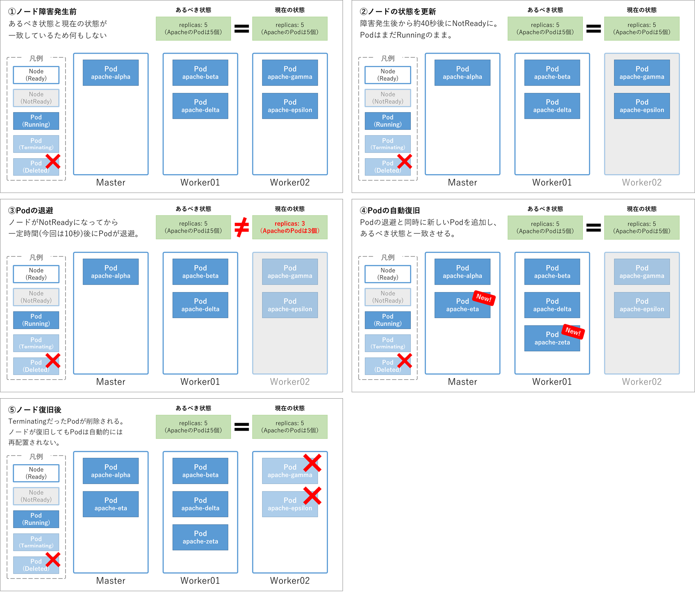

ここで注意したいのが、デフォルトでは**ノード障害から復旧しても、自動的にPodが再配置されることはない**ということです。
上記の結果を見ると、 `raspi-k8s-worker02` Nodeが復旧しているにも拘らず、Podは `raspi-k8s-master` Nodeと`raspi-k8s-worker01` Nodeに偏っていることが分かります。

Podがいくつかのノードに偏ってしまうと、負荷がかかってパフォーマンスが下がったり、単一障害点(SPOF)になったりする可能性があります。そのような状態を避けるために、Podを常にバランスよく分散させる [kube-descheduler](https://github.com/kubernetes-sigs/descheduler/tree/master) という機能も開発されています。

### 4.5 アプリケーションの公開（未）

これまでの作業でアプリケーションはデプロイできましたが、現在の状態ではクラスタ外部からアプリケーションにアクセスすることができません。

この章では、クラスタ外部からアプリケーションにアクセスできるようにしていきます。

#### 4.5.1 Serviceの概要とアプリケーションの外部公開

実際にアプリケーションを公開する前に、アプリケーションの公開に必要なKubernetesのリソース（Service やIngress）について簡単に説明します。
（厳密な定義や仕組みとは異なるのであくまでイメージとして捉えてください）

ServiceとはPodへの接続を解決してくれるリソースです。
Serviceにアクセスするとそれに紐づいたPodにトラフィックが振り分けられます。

ServiceにはClusterIP,  NodePort, LoadBalancer, ExternalNameという4種類のタイプが存在します。
このうち、NodePort と LoadBalancer は外部公開に使用されます。
また、Serviceとは別に外部公開やアクセス制御を行うための Ingress というリソースが存在します。

ここでは、よく使用される ClusterIP Service, NodePort Service, LoadBalancer Service, Ingressについて簡単に説明します。

##### ClusterIP Service

ClusterIP Service はKubernetes内での通信で利用されます。ClusterIP Service を作成すると、クラスタ内で利用可能なIPアドレスが払い出されます。そのIPアドレスにアクセスすると、Serviceに紐づくPodにトラフィックが振り分けられます。
「[4.5.3 ClusterIP Serviceでの公開](#4.5.3 ClusterIP Serviceでの公開)」にて、その動作を確認します。

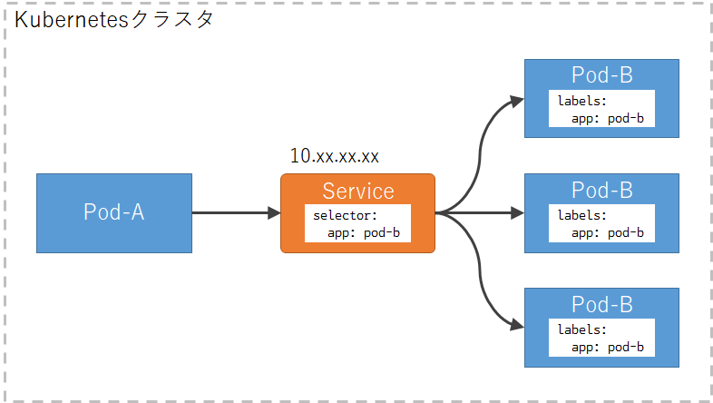

##### NodePort Service

NodePort Service はクラスタに参加しているNodeのランダムなポート(デフォルトだと30000~32767)を使用して、クラスタ外部にアプリケーションを公開します。NodePort Service は ClusterIP Service を拡張して実装されています。
「[4.5.4 NodePort Serviceでの公開](#4.5.4 NodePort Serviceでの公開)」にて、その動作を確認します。

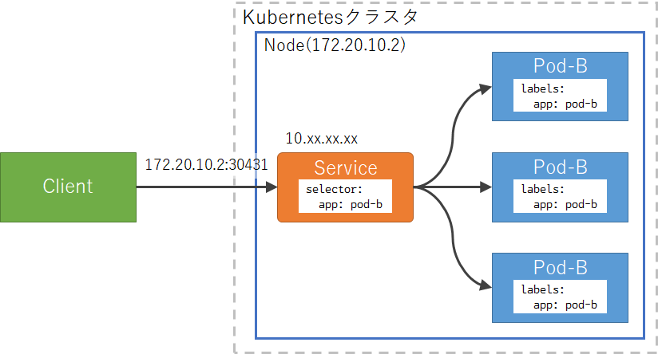

この方法で公開した場合、アプリケーションにアクセスするには、`いずれかのNodeのIPアドレス`と`NodePortで使用しているポート` を指定する必要があります。
そのため、アクセスしていたNodeが削除されたり、異常終了していたりするとアクセス不能になるというデメリットがあります。その場合は、他の有効なNodeのIPアドレスを指定すればアクセス可能ですが、常にそれを把握してアクセス先を変更するのは面倒です。
そのデメリットを解消したのが、次に紹介する LoadBalancer Service です。

##### LoadBalancer Service

LoadBalancer Serviceは、内部でNodePortを作成したうえで、クラスタ外部もしくは内部にLoadBalancerを作成し、LoadBalancerのロードバランス先（バックエンド）として疎通可能なNodeとNodePortに転送します。

本研修では使用しません。

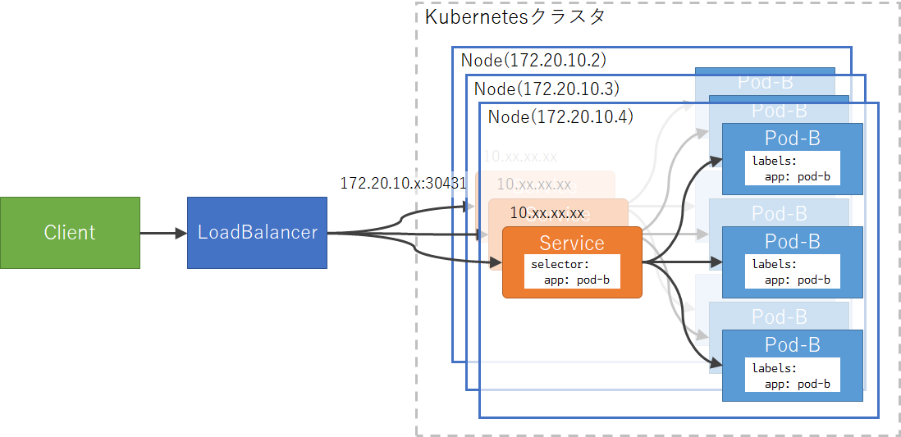

パブリッククラウド上に構築したKubernetesの場合は、LoadBalancer Serviceを作成すると、そのパブリッククラウドで提供されているLoadBalancerがクラスタ外部に作成されます。
例えば、AWSだとNetworkLoadBalancer もしくは ClassicLoadBalancerが作成されます。

一方で、本研修のようなベアメタルな環境では、デフォルトだとLoadBalancer Serviceを使用することができません。
これはベアメタルな環境では、クラスタ外部にLoadBalancerを動的に作成したり設定したりすることが難しいためです。ただし、[MetalLB](https://metallb.universe.tf/) というアプリケーションをデプロイすれば、ベアメタルな環境でもLoadBalancer Serviceを使用できるようになります。

##### Ingress

ここまでで紹介したNodePort ServiceやLoadBalancer Serviceでもアプリケーションの外部公開は可能ですが、Ingressを用いることでSSL/TLS終端の設定やパスによるルーティング、重み付き負荷分散など、より柔軟な設定が可能となります。

Ingressはデフォルトでは有効になっておらず、Ingress Controllerというアプリケーションをデプロイすることで利用可能になります。様々なベンダがIngress Controllerを開発しており、どのIngress Controllerを使用するかは用途や性能で自由に選択することができます。
良く使用されるIngress Controllerとして、[NGINX Ingress Controller](https://kubernetes.github.io/ingress-nginx/) があります。

「[4.5.5 Ingressでの公開](#4.5.5 Ingressでの公開)」にて、その動作を確認します。

#### 4.5.2 公開するアプリケーションの準備

アプリケーションを公開する前に、公開するアプリケーションを用意しましょう。
今回はApacheとNGINXという2種類のWebサーバをデプロイしていきます。

1. 検証用のNamespaceを作成

   ```bash
   $ kubectl create namespace publish-app
   ```
   
2. Apache(httpd)をデプロイ

   この手順ではApacheのDeploymentとConfigMapをデプロイします。
   ConfigMapには `index.html` が定義されており、それをDeploymentがApacheのドキュメントルート配下の`httpd`ディレクトリにマウントしている。

   ```bash
   # Apacheのマニフェストを確認
   $ cd ~/raspi-k8s-training/manifests/
   $ cat ./4.5/apache.yaml
   ---
   apiVersion: v1
   kind: ConfigMap
   metadata:
     name: httpd-html
     namespace: publish-app
   data:
     index.html: |
       Welcome to Apache(httpd)!
   ---
   apiVersion: apps/v1
   kind: Deployment
   metadata:
     name: httpd
     namespace: publish-app
   spec:
     replicas: 1
     selector:
       matchLabels:
         app: httpd
     template:
       metadata:
         labels:
           app: httpd
       spec:
         containers:
         - image: httpd:alpine
           name: httpd
           ports:
           - containerPort: 80
           volumeMounts:
           - name: contents
             mountPath: /usr/local/apache2/htdocs/httpd/
         volumes:
         - name: contents
           configMap:
             name: httpd-html
   ```

   ```bash
   $ kubectl apply -f ./4.5/apache.yaml
   configmap/httpd-html created
   deployment.apps/httpd created
   ```

3. NGINXをデプロイ

   この手順ではNGINXのDeploymentとConfigMapをデプロイします。
   ConfigMapには `index.html` が定義されており、それをDeploymentがNGINXのドキュメントルート配下の`nginx`ディレクトリにマウントしている。

   ```bash
   # NGINXのマニフェストを確認
   $ cd ~/raspi-k8s-training/manifests/
   $ cat ./4.5/nginx.yaml
   ---
   apiVersion: v1
   kind: ConfigMap
   metadata:
     name: nginx-html
     namespace: publish-app
   data:
     index.html: |
       Welcome to nginx!!
   ---
   apiVersion: apps/v1
   kind: Deployment
   metadata:
     name: nginx
     namespace: publish-app
   spec:
     replicas: 1
     selector:
       matchLabels:
         app: nginx
     template:
       metadata:
         labels:
           app: nginx
       spec:
         containers:
         - image: nginx:alpine
           name: nginx
           ports:
           - containerPort: 80
           volumeMounts:
           - name: contents
             mountPath: /usr/share/nginx/html/nginx
         volumes:
         - name: contents
           configMap:
             name: nginx-html
   ```

   ```bash
   $ kubectl apply -f ./4.5/nginx.yaml
   configmap/nginx-html created
   deployment.apps/nginx created
   ```

4. ApacheとnginxのPodがReadyになるまで待機

   ```bash
   # ApacheとnginxのPodがReadyになるまで待機
   $ kubectl wait pod -n publish-app --all --for=condition=Ready --timeout=5m
   pod/httpd-55583ft421-2q5ks condition met
   pod/nginx-54fdf853c7-wf83h condition met
   
   # ApacheとnginxのPodがReadyになっていることを確認
   $ kubectl get pod -n publish-app
   NAME                     READY   STATUS    RESTARTS   AGE
   httpd-55583ft421-2q5ks   1/1     Running   0          4m15s
   nginx-54fdf853c7-wf83h   1/1     Running   1          4m35s
   ```

公開するアプリケーションの準備はこれで完了。

#### 4.5.3 ClusterIP Serviceでの公開

現在の状態ではクラスタ内部で通信する場合でもPodのIPアドレスを指定する必要があります。
ただ、PodのIPアドレスは作成されるたびにランダムに決まるため、このままだと不便です。

そこで、ClusterIP Serviceを作成することで、クラスタ内部で名前解決できること、さらにPodのIPアドレスが変わってもServiceの設定を変更することなくアクセスできることを確認していきます。

1. ApacheのClusterIP Serviceをデプロイ

   ```bash
   # ApacheのClusterIP Serviceのマニフェストを確認
   $ cd ~/raspi-k8s-training/manifests/
   $ cat ./4.5/apache-clusterip.yaml
   apiVersion: v1
   kind: Service
   metadata:
     name: httpd-clusterip
     namespace: publish-app
   spec:
     ports:
     - port: 80
       protocol: TCP
       targetPort: 80
     selector:
       app: httpd
     type: ClusterIP
   ```

   ```bash
   $ kubectl apply -f ./4.5/apache-clusterip.yaml
   service/httpd-clusterip created
   ```

2. NGINXのClusterIP Serviceをデプロイ

   ```bash
   # NGINXのClusterIP Serviceのマニフェストを確認
   $ cd ~/raspi-k8s-training/manifests/
   $ cat ./4.5/nginx-clusterip.yaml
   apiVersion: v1
   kind: Service
   metadata:
     name: nginx-clusterip
     namespace: publish-app
   spec:
     ports:
     - port: 80
       protocol: TCP
       targetPort: 80
     selector:
       app: nginx
     type: ClusterIP
   ```

   ```bash
   $ kubectl apply -f ./4.5/nginx-clusterip.yaml
   service/nginx-clusterip created
   ```

3. Serviceの一覧を確認

   ```bash
   $ kubectl get service -n publish-app
   NAME              TYPE        CLUSTER-IP       EXTERNAL-IP   PORT(S)   AGE
   httpd-clusterip   ClusterIP   10.111.224.54    <none>        80/TCP    3m8s
   nginx-clusterip   ClusterIP   10.103.173.148   <none>        80/TCP    2m
   ```

4. クラスタ内部でClusterIP Serviceを介してApache Podにアクセスできることを確認

   NGINX PodからApacheのClusterIP Serviceに対してアクセスしてみます。

   ```bash
   # NGINX PodからApacheのClusterIP Serviceに対してwgetを実行
   $ kubectl exec -n publish-app deploy/nginx -- http://httpd-clusterip/
   <html><body><h1>It works!</h1></body></html>
   
   # ClusterIP　ServiceのIPアドレスを指定しても同じ動作になる
   $ APACHE_CLUSTERIP=`kubectl get svc -n publish-app httpd-clusterip -ojsonpath='{.spec.clusterIP}'`
   $ kubectl exec -n publish-app deploy/nginx -- http://${APACHE_CLUSTERIP}/
   <html><body><h1>It works!</h1></body></html>
   
   # httpdパスを指定するとマウントしたファイルが出力される
   $ kubectl exec -n publish-app deploy/nginx -- http://httpd-clusterip/httpd/
   Welcome to Apache(httpd)!
   ```

   このようにApacheのClusterIP Serviceで名前解決することで、ApacheのPodにアクセスできていることが分かります。

5. クラスタ内部でClusterIP Serviceを介してNGINX Podにアクセスできることを確認

   今度は逆にApache PodからNGINXのClusterIP Serviceに対してアクセスしてみます。

   ```bash
   # Apache PodからNGINXのClusterIP Serviceに対してwgetを実行
   # ちょっと長くなるのでタイトルだけ抽出
   $ kubectl exec -n publish-app deploy/httpd -- http://nginx-clusterip/ | grep title
   <title>Welcome to nginx!</title>
   
   # ClusterIP　ServiceのIPアドレスを指定しても同じ動作になる
   $ NGINX_CLUSTERIP=`kubectl get svc -n publish-app nginx-clusterip -ojsonpath='{.spec.clusterIP}'`
   $ kubectl exec -n publish-app deploy/nginx -- http://${NGINX_CLUSTERIP}/ | grep title
   <title>Welcome to nginx!</title>
   
   # nginxパスを指定するとマウントしたファイルが出力される
   $ kubectl exec -n publish-app deploy/nginx -- http://httpd-clusterip/nginx/
   Welcome to nginx!!
   ```

6. PodのIPアドレスが変わってもServiceを介してアクセスできることを確認

   今回はApache Podを削除してIPアドレスを変更したうえで、NGINX PodからApacheのClusterIP Serviceを介してアクセスしてみます。

   ```bash
   # 現在のApache PodのIPアドレスを確認
   $ kubectl get pod -n publish-app httpd -owide -l app=httpd
   NAME                     READY   STATUS    RESTARTS   AGE   IP             NODE                 NOMINATED NODE   READINESS GATES
   httpd-55584fd454-nj791   1/1     Running   0          10m   10.244.2.293   raspi-k8s-worker02   <none>           <none>
   
   # Apache Podを削除
   $ kubectl delete pod -n publish-app -l app=httpd
   pod "httpd-55584fd454-nj791" deleted
   
   # Apache Podが再作成され、IPアドレスが変わっていることを確認
   $ kubectl get pod -n publish-app httpd -owide -l app=httpd
   NAME                     READY   STATUS    RESTARTS   AGE     IP            NODE                 NOMINATED NODE   READINESS GATES
   httpd-55584fd454-hx9bs   1/1     Running   0          2m13s   10.244.2.94   raspi-k8s-worker02   <none>           <none>
   
   # NGINX PodからApacheのClusterIP Serviceに対してwgetを実行
   $ kubectl exec -n publish-app deploy/nginx -- http://httpd-clusterip/
   <html><body><h1>It works!</h1></body></html>
   ```

このようにPodが追加・削除されてもClusterIP Serviceが稼働中のPodに転送してくれるため、PodのIPアドレスに依存することなくアクセスすることができます。

#### 4.5.4 NodePort Serviceでの公開

次にクラスタ外部からアプリケーションにアクセスできるようNodePort Serviceを作成し、その動作を確認します。

1. ApacheのNodePort Serviceをデプロイ

   ```bash
   # ApacheのNodePort Serviceのマニフェストを確認
   $ cd ~/raspi-k8s-training/manifests/
   $ cat ./4.5/apache-nodeport.yaml
   apiVersion: v1
   kind: Service
   metadata:
     name: httpd-nodeport
     namespace: publish-app
   spec:
     ports:
     - port: 80
       protocol: TCP
       targetPort: 80
     selector:
       app: httpd
     type: NodePort
   ```

   ```bash
   $ kubectl apply -f ./4.5/apache-nodeport.yaml
   service/httpd-nodeport created
   ```

2. NGINXのNodePort Serviceをデプロイ

   ```bash
   # NGINXのNodePort Serviceのマニフェストを確認
   $ cd ~/raspi-k8s-training/manifests/
   $ cat ./4.5/nginx-nodeport.yaml
   apiVersion: v1
   kind: Service
   metadata:
     name: nginx-nodeport
     namespace: publish-app
   spec:
     ports:
     - port: 80
       protocol: TCP
       targetPort: 80
     selector:
       app: nginx
     type: NodePort
   ```

   ```bash
   $ kubectl apply -f ./4.5/nginx-nodeport.yaml
   service/nginx-nodeport created
   ```

3. NodePort Serviceの一覧を確認

   ClusterIP Serviceと異なり、PORT(S)列にNodePortが表示されていることが分かる。

   下記の結果の場合だと、Apacheにアクセスするには `http://<NodeのIPアドレス>:30357` 、NGINXにアクセスするには `http://<NodeのIPアドレス>:32579` を指定すればよい。

   ```bash
   $ kubectl get service -n publish-app | grep -E "NAME|NodePort"
   NAME             TYPE       CLUSTER-IP      EXTERNAL-IP   PORT(S)        AGE
   httpd-nodeport   NodePort   10.104.98.89    <none>        80:30357/TCP   2m1s
   nginx-nodeport   NodePort   10.103.244.92   <none>        80:32579/TCP   112s
   ```

4. クラスタ外部からApacheにアクセスできることを確認

   今回はクラスタ外部からアクセスするクライアントとして、iPhoneのブラウザ（SafariでもEdgeでも可）を使用します。

   iPhoneのブラウザでApache(`http://172.20.10.2:30357`)にアクセス。

   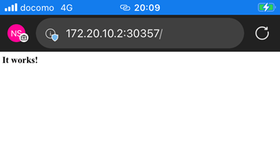

   ちなみに指定するNodeのIPアドレスを変更しても同じページにアクセスできます。

   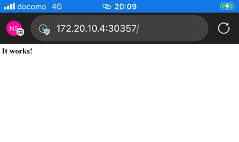

5. クラスタ外部からNGINXにアクセスできることを確認

   iPhoneのブラウザでNGINX(`http://172.20.10.2:32579`)にアクセス。

   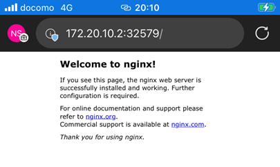

   同様に指定するNodeのIPアドレスを変更しても同じページにアクセスできます。

   

これでNodePort Serviceを用いてクラスタ外部にアプリケーションを公開できました。

#### 4.5.5 Ingressでの公開（未）

最後にIngressを使うことで、より柔軟にアプリケーションを外部公開できることを確認していきます。

1. NGINX Ingress Controllerをデプロイ

   Ingressを使用できるようにするために、NGINX Ingress Controllerをデプロイします。

   ```bash
   $ kubectl apply -f \
   https://raw.githubusercontent.com/kubernetes/ingress-nginx/controller-v0.47.0/deploy/static/provider/baremetal/deploy.yaml
   ```

2. Nginx Ingress ControllerのPodがReadyになるまで待機

   ```bash
   # Nginx Ingress ControllerのPodがReadyになるまで待機
   $ kubectl wait pod -n ingress-nginx -l app.kubernetes.io/component=controller --for=condition=Ready --timeout=5m
   pod/ingress-nginx-controller-55bc4f5565-p2mh4 condition met
   
   # Nginx Ingress ControllerのPodがReadyになっていることを確認
   $ kubectl get pod -n ingress-nginx
   NAME                                        READY   STATUS      RESTARTS   AGE
   ingress-nginx-admission-create-v9m2t         0/1     Completed   0          2m15s
   ingress-nginx-admission-patch-ph5th          0/1     Completed   1          2m15s
   ingress-nginx-controller-55bc4f5565-p2mh4   1/1     Running     0          2m15s
   ```

   `ingress-nginx-admission-create-xxxxx` Podや`ingress-nginx-admission-patch-xxxxx` PodがCrashLoopBackOffとなる場合は、すべてのノードを再起動した上で以下のコマンドを実行します。

   ```bash
   $ kubectl replace --force -f \
   https://raw.githubusercontent.com/kubernetes/ingress-nginx/controller-v0.47.0/deploy/static/provider/baremetal/deploy.yaml
   ```

   上記コマンドを実行したら、再度PodがReadyになるまで待機する。

3. パスでルーティングするようなIngressを作成

   ```bash
   # Ingressのマニフェストを確認
   $ cd ~/raspi-k8s-training/manifests/
   $ cat ./4.5/ingress-path.yaml
   apiVersion: networking.k8s.io/v1
   kind: Ingress
   metadata:
     name: ingress-path
     namespace: publish-app
   spec:
     rules:
     - http:
         paths:
         - path: /nginx
           backend:
             service: 
               name: nginx-clusterip
               port:
                 number: 80
         - path: /httpd
           backend:
             service:
               name: httpd-clusterip
               port:
                 number: 80
   ```

   ```bash
   $ kubectl apply -f ./4.5/ingress-path.yaml
   ```

4. Nginx Ingress ControllerのNodePort Serviceを確認

   ```bash
   # Nginx Ingress ControllerのNodePort Serviceを確認
   # NodePortのポート番号はランダムなので、以下の結果と異なる場合があります
   $ kubectl get -n ingress-nginx svc/ingress-nginx-controller
   NAME                       TYPE        CLUSTER-IP       EXTERNAL-IP   PORT(S)                      AGE
   ingress-nginx-controller   NodePort    10.107.214.154   <none>        80:30431/TCP,443:30017/TCP   48m
   
   # httpのポートを環境変数に格納
   $ HTTP_PORT=$(kubectl get -n ingress-nginx svc/ingress-nginx-controller \
   -o jsonpath='{.spec.ports[?(@.name=="http")].nodePort}')
   
   # 環境変数の中身を確認
   $ echo ${HTTP_PORT}
   30431
   ```

5. Apacheとnginxにアクセス
   Master, WorkerのいずれかのIPアドレス（今回は、`172.20.10.2`とする）に、手順4で取得したNodePortでアクセスします。

   ```bash
   $ curl http://172.20.10.2:${HTTP_PORT}/nginx/
   Welcome to nginx!!
   
   $ curl http://172.20.10.2:${HTTP_PORT}/httpd/
   Welcome to Apache(httpd)!
   ```

   それぞれApacheとNginxからレスポンスが返ってきており、複数のアプリを1つのNodePort Serviceで公開できていることがわかります。。

   以下は今回作成したIngressのイメージ図です。

   

   まず、30431番ポートへのリクエストをNginx ingress controllerが受け取り、そのリクエストのパスとIngressに設定したルールに従って、リクエストをPodに振り分けることでL7 LoadBalancingを実現しています。


### 4.6 メトリクスの監視（未）

#### 4.6.1 metrics-serverの追加（未）

デフォルトの状態ではKubernetesクラスタのメトリクスを取得することができないため、**metrics-server**をデプロイします。
**metrics-server**をデプロイすることで、`kubectl top`コマンドを用いてKubernetesクラスタのメトリクスを収集できるようになります。

1. (Master) `kubectl top`が動作しないことを確認

   ```bash
   $ kubectl top node
   Erro from server (NotFound): the server could not find the requested resource (get services http:heapster:)
   ```

2. (Master) metrics-serverをデプロイ

   ```bash
   $ cd ~/raspi-k8s-training/manifests/
   $ kubectl apply -f ./4.6/metrics-server/manifests/base/
   ```

5. (Master) metrics-serverが正常にデプロイされたことを確認

   ```bash
   $ kubectl get pod -n kube-system | grep metrics-server
   metrics-server-xxxxxxxxxx-yyyyy   1/1     Running   0          1m
   ```

6. (Master) `kubectl top`が機能することを確認

   ```bash
   $ kubectl top node
   NAME                 CPU(cores)   CPU%   MEMORY(bytes)   MEMORY%
   raspi-k8s-master     388m         9%     570Mi           14%
   raspi-k8s-worker01   179m         4%     320Mi           8%
   raspi-k8s-worker02   193m         4%     303Mi           7%
   ```

   以下が出力される場合は、しばらくしてから再度実行してみる

   ```bash
   $ kubectl top node
   error: metrics not available yet
   ```

#### 4.6.2 メトリクスの可視化（未）

SamplerというOSSを用いて、Masterに接続したディスプレイにKuberntesクラスタのメトリクスを表示できるようにする。

この手順は

1. (Master) プロジェクトをクローン
   @reireias氏が[sampler](https://github.com/sqshq/sampler)プロジェクトをフォークし、Arm用に改変したものを利用する。

   ```bash
   $ git clone https://github.com/reireias/sampler.git
   ```

2. (Master) Go言語をインストール

   ```bash
   $ sudo apt install golang
   ```

3. (Master) samplerをビルド

   ```bash
   $ cd ~/sampler
   $ GOOS=linux GOARCH=arm GOARM=7 go build
   ```

4. (Master) パスが通っている場所にsamplerを移動

   ```bash
   $ sudo mv ~/sampler/sampler /usr/bin
   ```

5. (Master) samplerの設定ファイルをコピー

   ```bash
   $ sudo mkdir /etc/sampler
   $ cd ~/raspi-k8s-training/manifests/
   $ sudo cp ./4.6/sampler/k8s.yaml /etc/sampler/k8s.yaml
   ```

6. (Master) `sampler`を実行し、表示を確認

   ```bash
   $ sampler -c /etc/sampler/k8s.yaml
   ```


#### 4.6.3 （おまけ）小型ディスプレイへのメトリクスの表示（未）

小型ディスプレイを使用するために、LCDドライバを設定します。本作業は小型ディスプレイを接続するノードのみに実施します。

1. ディスプレイ用のプロジェクトをclone

   ```bash
   $ git clone https://github.com/kedei/LCD_driver
   ```

   カレントディレクトリに **LCD_driver** が展開されたことを確認

   ```bash
   $ ls -l | grep LCD_driver
   drwxr-xr-x 6 tarte tarte 4096 Aug Jul 29 17:16 LCD_driver
   ```
   
2. 権限を付与

   ```bash
   $ sudo chmod -R 777 LCD_driver
   
   #権限が(drwxrwxrwx)に変更されたことを確認
   $ ls -l | grep LCD_driver
   drwxrwxrwx 6 tarte tarte 4096 Aug Jul 29 17:16 LCD_driver
   ```

3. `LCD_driver`ディレクトリに移動

   ```bash
   $ cd LCD_driver
   ```

4. LCDドライバをインストール

   ```bash
   $ ./LCD35_show
   ```

   【補足内容】 
   LCDドライバインストール後に再起動が実行されます。 
   インストール後、以下方法でHDMI接続ディスプレイ表示 <==> 3.5インチディスプレイの切替が可能ですが、両ディスプレイを同時には利用できません。  

   - 3.5インチディスプレイ表示切替

     ```bash
     $ cd ~/LCD_driver
     $ sudo ./LCD35_show
     # コマンド実行後に再起動され、3.5インチディスプレイ側で起動表示されます
     ```

   - HDMIディスプレイ表示切替

     ```bash
     $ cd ~/LCD_driver
     $ sudo ./LCD_hdmi
     # コマンド実行後に再起動され、HDMIディスプレイ側で起動表示されます
     ```

#### 4.6.4（おまけ）samplerの起動時自動実行設定（未）

1. (Master) 以下のコマンドを実行し、`~/.profile`に追記

   ```bash
   $ echo 'if [ $(tty) == "/dev/tty1" ]; then sampler -c /etc/sampler/k8s.yaml; fi' >> ~/.profile
   ```

   これでログイン時に自動でsamplerを実行してくれるようになる
   ただし、ログインは自動化されないので、以降の手順で自動ログインを有効にしていく

2. (Master) `raspi-config`を実行

   ```bash
   $ sudo raspi-config
   ```

3. `3 Boot Options`を選択

4. `B1 Desktop / CLI`を選択

5. `B2 Console Autologin`を選択

6. `<Finish>`を選択

7. 再起動の確認をされるので、`<Yes>`を選択

8. Masterに接続されているディスプレイに、samplerが表示されていることを確認


## おわりに

お疲れさまでした。以上で本研修の内容は完了です。

構築したKubernetesクラスタはハンズオン研修の完了までは、壊さない限り自由に使っていただいて構いません。

ただし、ハンズオン教育終了から翌2日以内に同梱の着払い伝票（ゆうパック）で忘れず返却してください。

コンテナ(Docker)やKubernetesについてより詳しく学習したい場合は、ソフトウェアエンジニアリング本部主催の「Docker入門ハンズオン」と「Kubernetes入門ハンズオン」をおすすめします。

- [Docker入門ハンズオン受講案内ページ | One NEC.com](https://one.nec.com/biz/si-service-dev/swe_tool_sde_op_training_handson-introduction-docker-preparation)
- [Kubernetes入門ハンズオン受講案内ページ | One NEC.com](https://one.nec.com/biz/si-service-dev/swe_tool_sde_op_training_handson-introduction-k8s-preparation)

また、ブラウザ上で実行可能なKubernetesの環境、オンラインラーニングKubernetesの公式ドキュメントにはブラウザ上で体験可能なチュートリアルが公開されているので、そちらを試してみることもおすすめします。

- [Kubernetesの基本を学ぶ | Kubernetes](https://kubernetes.io/ja/docs/tutorials/kubernetes-basics/)

他にも **[Katacoda](https://www.katacoda.com/)** という無料のオンラインラーニングサービスでもKubernetesのコースが公開されているのでお試しください。

いくつかのシナリオに沿って、ブラウザ上で実際にKubernetesを操作することができるので、とてもお手軽に学習することができます。

- [Learn Kubernetes using Interactive Browser-Based Labs | Katacoda](https://www.katacoda.com/courses/kubernetes)

